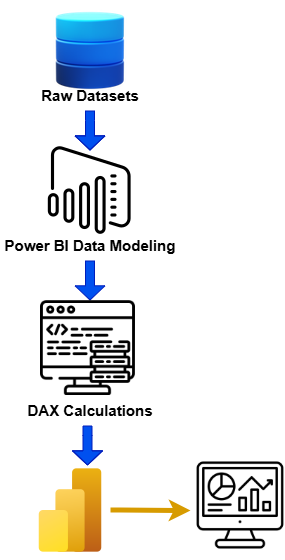
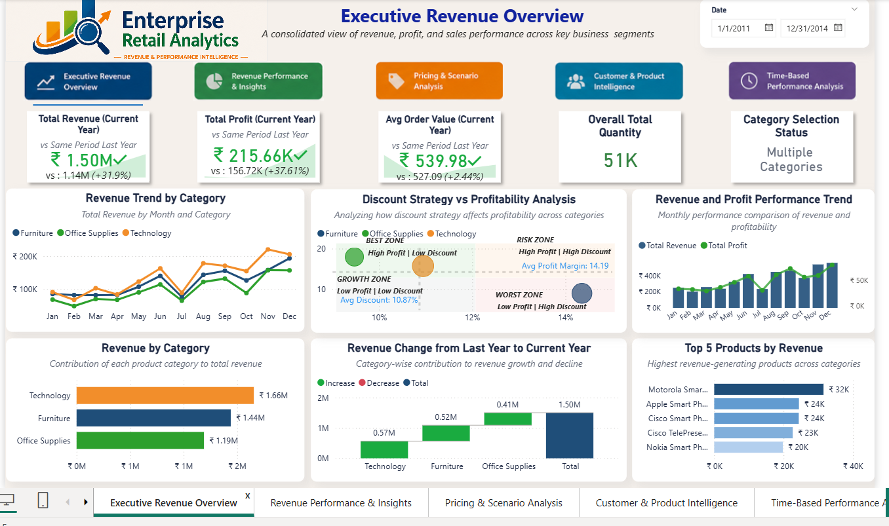
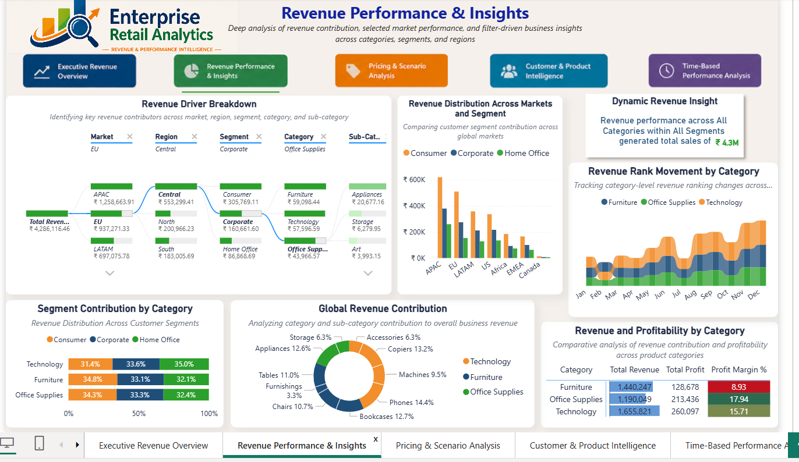
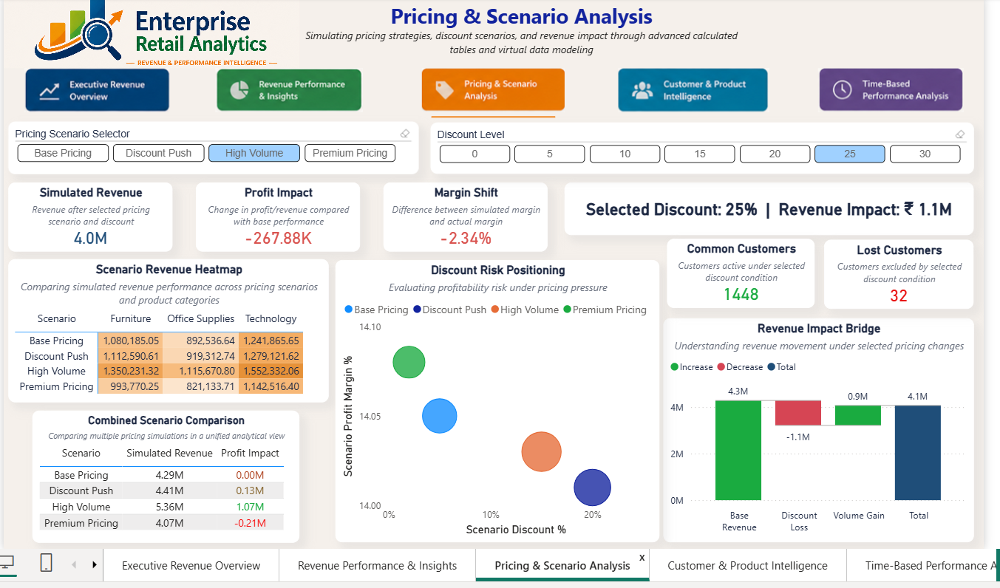
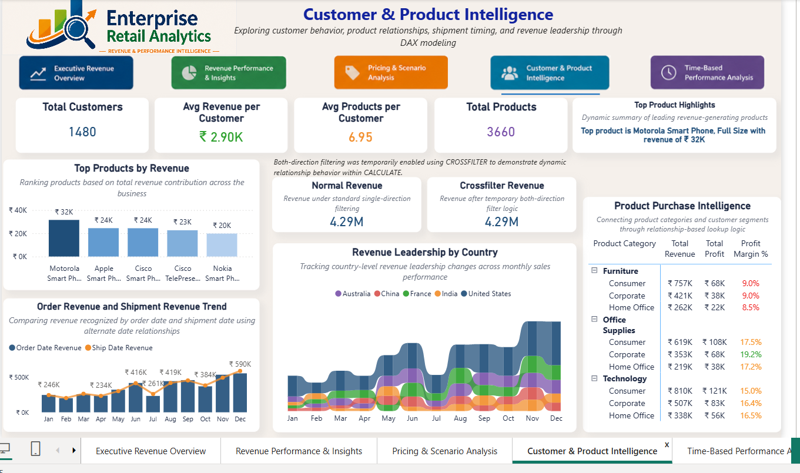
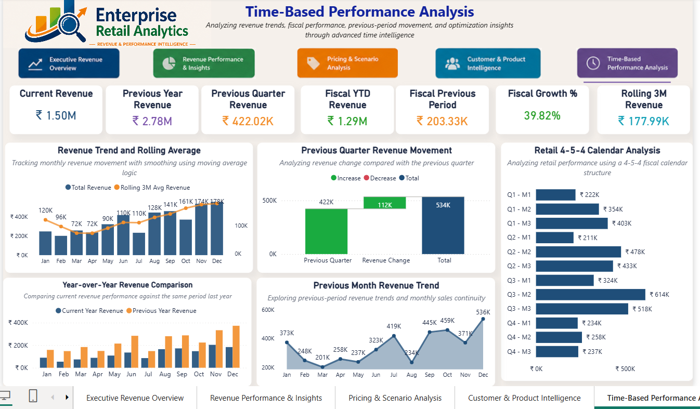

# 🛒 Enterprise Retail Revenue Intelligence Platform

A complete end-to-end Retail Business Intelligence project focused on revenue analytics, pricing simulation, customer intelligence, and advanced time-based performance analysis.

Built using:

# Power BI →  DAX Modeling

---

# 🔗 Live Dashboard

👉 (Add your Power BI Service Link Here)

[View Dashboard](YOUR_LINK_HERE)

---

---

# 📌 Project Overview

This project is a complete **Enterprise Retail Revenue Intelligence System** designed to analyze:

- Revenue performance
- Profitability trends
- Customer behavior
- Product intelligence
- Pricing simulation
- Time-based performance
- Fiscal calendar analysis

The goal of this project was not only to build dashboards, but also to demonstrate:

- Advanced DAX mastery
- Enterprise data modeling
- Scenario simulation
- Time intelligence
- Relationship modeling
- Business storytelling

---

## 🛤️ Project Roadmap

---

# 🛠️ Tools & Technologies

| Tool | Purpose |
|------|----------|
| Power BI | Dashboard & visualization |
| DAX | KPI calculations & advanced analytics |
| Power Query | Data transformation |
| Data Modeling | Relationship & star schema modeling |

---

# 🧱 Data Modeling

## Fact Table
- fact_sales

## Dimension Tables
- dim_customer
- dim_product
- dim_date

---

# 🔗 Relationship Modeling Used

This project includes advanced relationship logic:

- RELATED
- RELATEDTABLE
- USERELATIONSHIP
- CROSSFILTER
- Filter propagation
- Context transition

---

# 🧮 Advanced DAX Concepts Covered

---

## 🔹 Core DAX

- CALCULATE
- FILTER
- ALL
- ALLSELECTED
- VALUES
- SELECTEDVALUE
- SWITCH
- COALESCE
- DIVIDE

---

## 🔹 Iterator Functions

- SUMX
- AVERAGEX
- RANKX
- CONCATENATEX

---

## 🔹 Time Intelligence

- DATEADD
- SAMEPERIODLASTYEAR
- PREVIOUSQUARTER
- PARALLELPERIOD
- TOTALYTD
- Rolling averages
- Fiscal calendar logic
- 4-5-4 retail calendar

---

## 🔹 Table & Set Functions

- INTERSECT
- EXCEPT
- UNION
- CROSSJOIN
- DATATABLE

---

## 🔹 Scenario Simulation

- Dynamic pricing simulation
- Discount impact analysis
- Revenue bridge analysis
- Margin shift simulation
- Scenario comparison logic

---

# 📊 Dashboard Pages

---

# 🟦 Page 1 — Executive Revenue Overview

## Purpose

Provides a high-level executive summary of:

- Revenue
- Profit
- Order value
- Category performance
- Revenue movement
- Discount vs profitability behavior

---

## Key Visuals

- KPI Cards
- Revenue Trend Analysis
- Discount Strategy Scatter
- Revenue & Profit Trend
- Waterfall Revenue Bridge
- Top Products Analysis

---

## Key Insights

- Technology category drives highest revenue
- Revenue trends fluctuate seasonally
- Discount strategy impacts profitability significantly

---

# 🟩 Page 2 — Revenue Performance & Insights

## Purpose

Deep analysis of:

- Revenue contribution
- Market performance
- Segment analysis
- Regional performance
- Revenue distribution

---

## Key Visuals

- Revenue Driver Breakdown
- Market & Segment Distribution
- Revenue Rank Movement
- Segment Contribution Analysis
- Global Revenue Contribution
- Profitability Matrix

---

## Key Insights

- APAC and EU contribute heavily to revenue
- Technology products dominate contribution
- Customer segments behave differently across markets

---

# 🟧 Page 3 — Pricing & Scenario Analysis

## Purpose

Simulate pricing scenarios and analyze revenue impact dynamically.

---

## Pricing Scenarios

- Base Pricing
- Discount Push
- High Volume
- Premium Pricing

---

## Key Visuals

- Scenario KPI Cards
- Revenue Heatmap
- Discount Risk Positioning
- Revenue Impact Bridge
- Scenario Comparison Table
- Customer Retention Impact

---

## Advanced DAX Demonstrated

- CROSSJOIN
- INTERSECT
- EXCEPT
- UNION
- DATATABLE
- Scenario simulation logic

---

## Key Insights

- High discount increases revenue but reduces margin
- Premium pricing improves margin stability
- Customer retention changes under pricing conditions

---

# 🟦 Page 4 — Customer & Product Intelligence

## Purpose

Analyze customer behavior, product relationships, and shipment intelligence.

---

## Key Visuals

- Customer KPI Cards
- Product Revenue Ranking
- Dynamic Product Highlights
- Order vs Shipment Revenue Trend
- Product Purchase Intelligence
- Revenue Leadership by Country

---

## Relationship Logic Used

- USERELATIONSHIP
- CROSSFILTER
- RELATED
- Iterator calculations

---

## Key Insights

- Shipment timing changes revenue recognition
- Product leadership differs across countries
- Customer segments contribute differently by category

---

# 🟪 Page 5 — Time-Based Performance Analysis

## Purpose

Advanced time intelligence and fiscal calendar analytics.

---

## Key Visuals

- Rolling Revenue Trend
- Previous Quarter Revenue Movement
- Year-over-Year Comparison
- Previous Month Revenue Trend
- Retail 4-5-4 Calendar Analysis
- Fiscal KPI Tracking

---

## Time Intelligence Covered

- Rolling averages
- SAMEPERIODLASTYEAR
- PREVIOUSQUARTER
- PARALLELPERIOD
- TOTALYTD
- DATEADD
- Fiscal calendar modeling
- Retail 4-5-4 calendar logic

---

## Key Insights

- Revenue shows strong seasonal concentration
- Quarter-over-quarter movement impacts overall growth
- Retail 4-5-4 structure highlights fiscal behavior patterns

---

# 📸 Dashboard Preview

## 🔹 Executive Revenue Overview

---

## 🔹 Revenue Performance & Insights

---

## 🔹 Pricing & Scenario Analysis

---

## 🔹 Customer & Product Intelligence

---

## 🔹 Time-Based Performance Analysis

---

# 💡 Key Business Insights

- Technology category contributes the highest revenue
- Discount-heavy strategies reduce profitability
- Customer contribution changes across categories
- Revenue patterns vary significantly across fiscal periods
- Time intelligence reveals strong seasonal concentration
- Shipment timing impacts recognized revenue

---

# 🧠 Skills Demonstrated

- Advanced DAX Modeling
- Enterprise Dashboard Design
- Scenario Simulation
- Time Intelligence
- Retail Analytics
- Relationship Modeling
- Business Storytelling
- Interactive Reporting
- Revenue Intelligence
- KPI Design

---

# ✅ Project Outcome

This project demonstrates a complete enterprise retail analytics system capable of:

- Monitoring revenue performance
- Simulating pricing strategies
- Tracking customer intelligence
- Performing advanced time-based analysis
- Evaluating profitability impact
- Supporting executive-level decision making

---

# 👨‍💻 About Me

## Sayan Naha

📧 **Email:** snsayan2012@gmail.com  
🔗 **LinkedIn:** [Sayan Naha](https://www.linkedin.com/in/sayan-naha/)
